# Weather ☀️ Compose

This project demonstrates a weather application that shows the current weather for any location. The **DVT Weather** app is built using Android Jetpack Compose, MVVM, Clean Architecture, and other modern Android development tools.

## 🚧 In Progress

The **Version Catalog** for the new Gradle version 8.8 works locally but **Dependabot** does not yet support this feature ([see this](https://github.com/dependabot/dependabot-core/pull/6249)). You can check the progress on the `v1.0.4/version_catalog` branch.

## 🔨 Building the App

- Used the latest version of Android Studio.
- Add the `BASE_URL`, `ONECALL_BASE_URL`, `API_KEY`, and `MAPS_API_KEY` inside `local.properties` to build and run the DVT Weather app. Why 2 BASE_URLs you may ask? Well, Open Weather Api 3.0 offers exclusive data to the endpoint One Call and cannot be called through the BAse url wchih is version 2.5 whereas the OneCall api is 3.0. 

    ```properties
    BASE_URL=https://api.openweathermap.org/data/2.5/
    ONECALL_BASE_URL=https://api.openweathermap.org/data/3.0/
    API_KEY=your_open_weather_api_key_here
    MAPS_API_KEY=your_google_maps_api_key_here
    ```

## 📸 Screenshots

| Light Mode | Dark Mode |
| :---: | :---: |
| 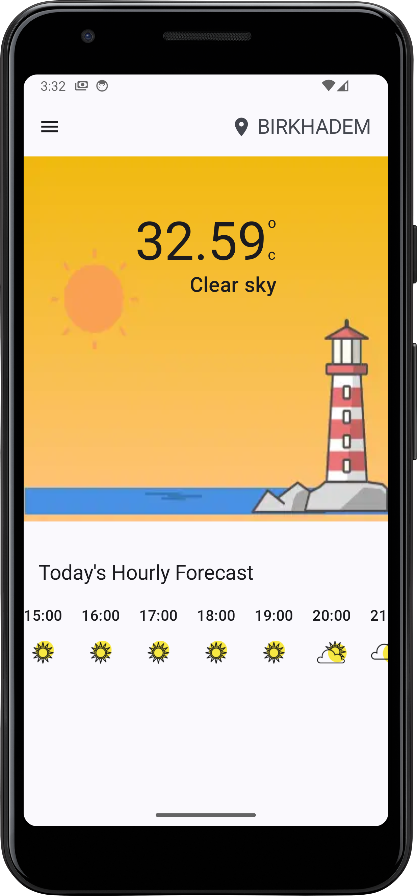 | 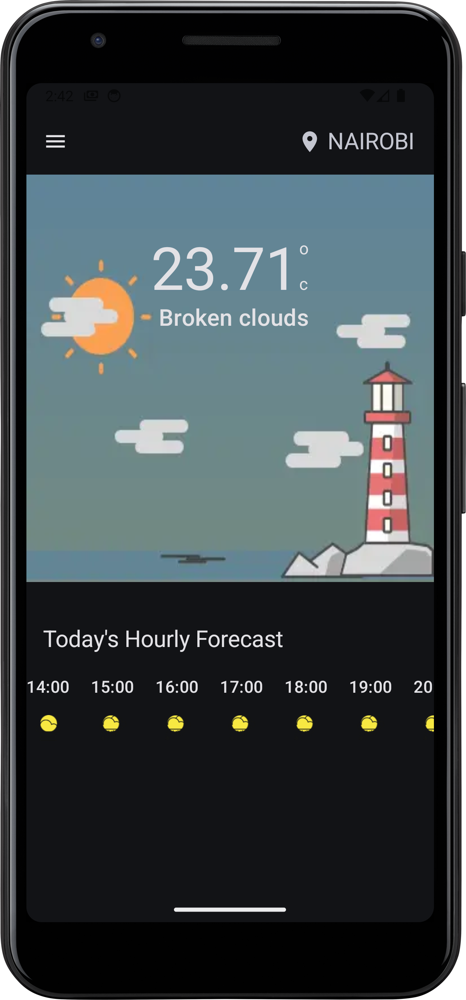 |
| 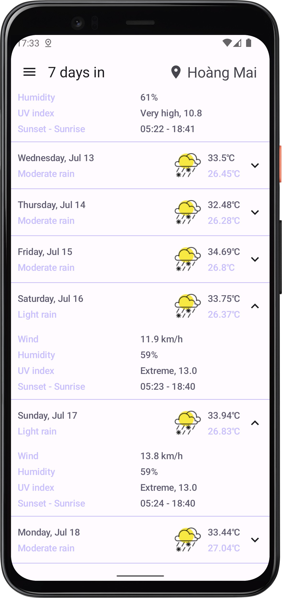 | 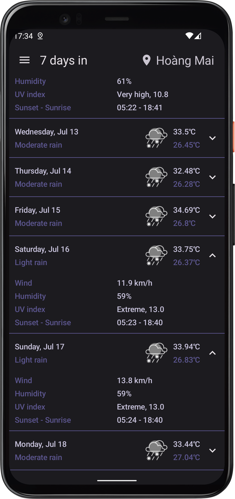 |
| 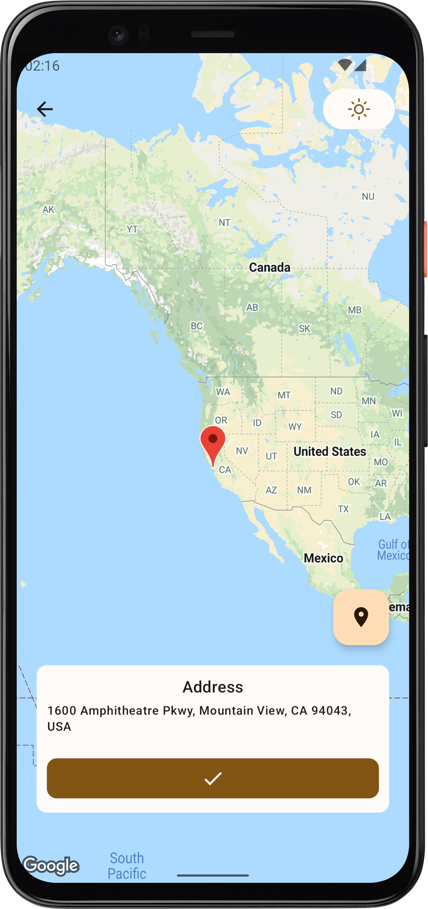 | 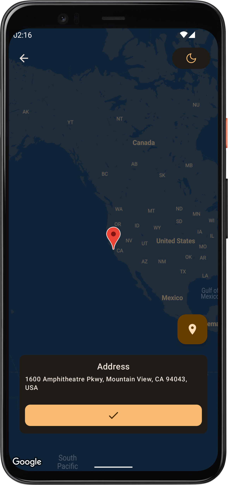 |
| 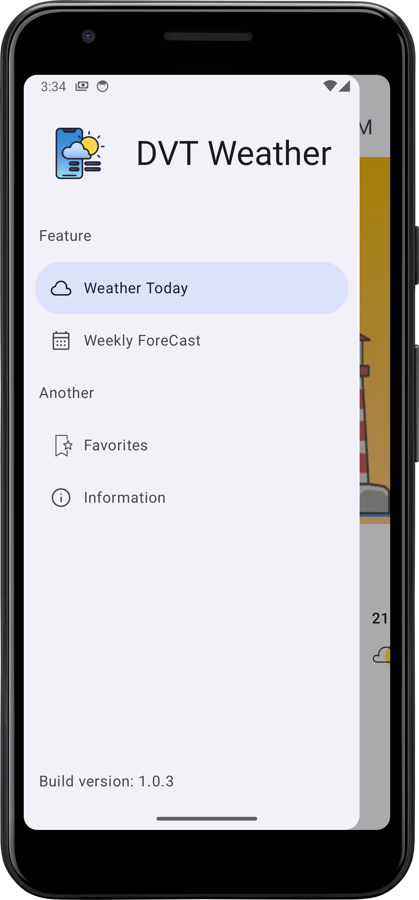 | 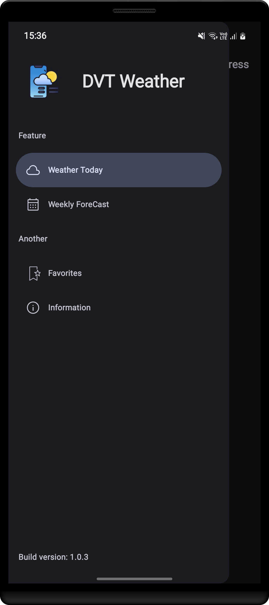 |
| 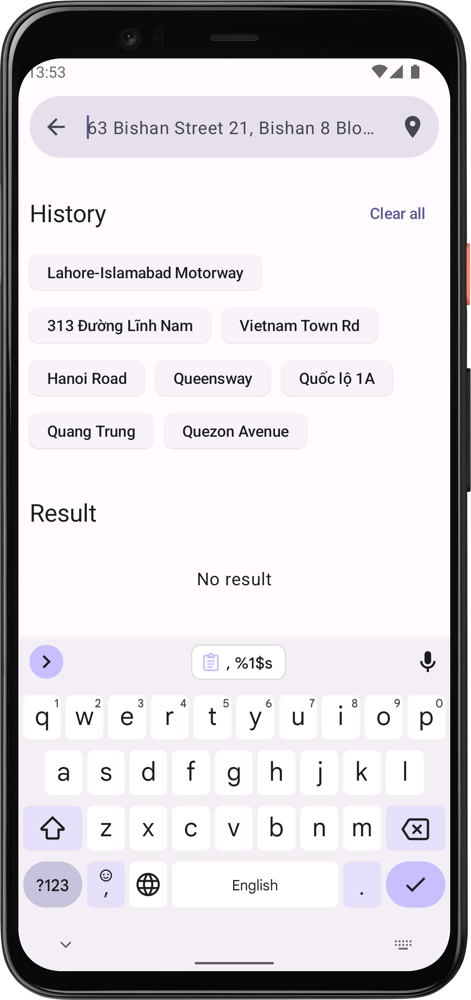 | 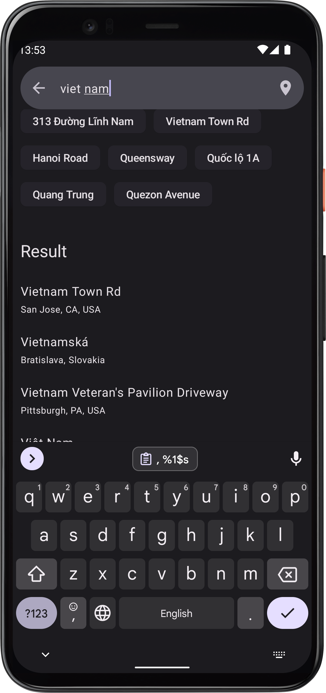 |

## 📚 Features

- Display current weather by location or name.
- Display a seven-day weather forecast by location or name.
- Select a location using Google Maps.
- Search for locations by address name using Google Places.
- Support for dark mode.
- Support for dynamic material from Android 13 and above.
- Support for English and Vietnamese.
- Favorites tab for the places you want to revisit.
- History of Searched places
- Dynamic Search function and display ( Basically displays your last search in animation inside the search Box)
## 🗂 Module

The DVT Weather app follows the Clean Architecture model combined with the MVVM design pattern. To learn more, refer to these resources:

- [Guide to app architecture by Google Android](https://developer.android.com/jetpack/guide)
- [Clean Architecture by Uncle Bob](https://blog.cleancoder.com/uncle-bob/2011/11/22/Clean-Architecture.html)

## 🔍 Unit Test

- Using [MockK](https://mockk.io/) to write unit tests.
- Using [Kotlin Reflection](https://kotlinlang.org/docs/reflection.html) to access private methods and properties.
- Using [Kotlin Kover](https://github.com/Kotlin/kotlinx-kover) to generate test coverage reports. To generate a report, run the command `./gradlew koverHtmlReport`.

## 🚊 Data Flow

The DVT Weather app uses `Flow` and `suspend` functions for data stream handling in the app.


## ❌ Error Flow

In the data module, when an error occurs, it is transformed into a `ResponseException`. In the domain and presentation layers, this error is further transformed into a `WeatherException` to display meaningful error messages in the UI.

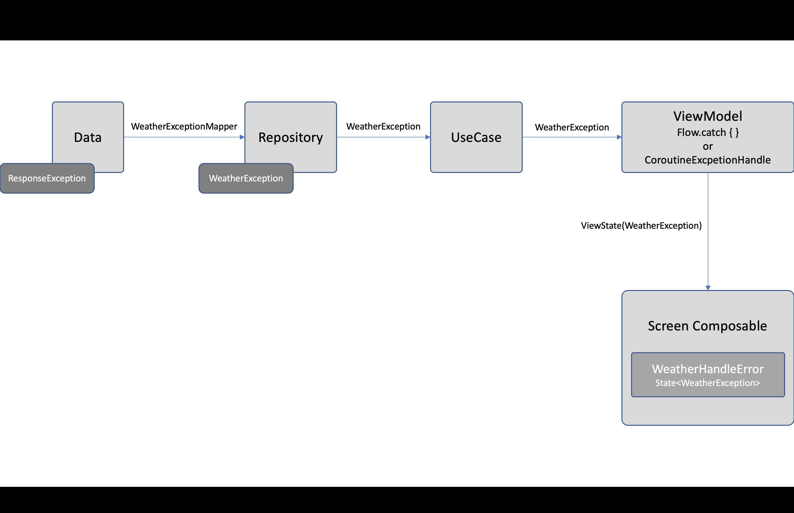

## 📝 API Integration Details

The DVT Weather app integrates with the OpenWeather API to fetch current weather and forecasts. Here are the endpoints used:

- **Current Weather**: [OpenWeather Current Weather API](https://openweathermap.org/current)
- **5-Day Forecast**:This no longer works as of June 2024 as Open Weather Api migrates from 2.5 to 3.0 which was a really tough integration to start with. For reference, check here: [OpenWeather 3.0](https://openweathermap.org/api)
- **One Call API**: The One Call API is used to get weather data for different time ranges, such as current, hourly, and daily forecasts. [OpenWeather One Call API](https://openweathermap.org/api/one-call-api)

### Handling Different Endpoints

To meet specific requirements and handle edge cases, we had to adapt and use different endpoints provided by OpenWeather. This ensures we can fetch accurate and comprehensive weather data for various needs.

## 🏗️ Architecture Overview

### Model-View-ViewModel (MVVM)

The MVVM architecture separates the code into three main components:

- **Model**: Handles the data and business logic. It interacts with the network or database to fetch and store data.
- **View**: Displays the data and forwards user interactions to the ViewModel.
- **ViewModel**: Serves as a bridge between the Model and the View. It holds the UI logic and the state of the UI.

### Data Flow

1. **User Interaction**: User actions are captured by the View.
2. **ViewModel**: The ViewModel processes these actions and updates the LiveData or StateFlow.
3. **Model**: The Model layer fetches or manipulates data and returns the results.
4. **ViewModel**: The ViewModel updates the LiveData or StateFlow with the new data.
5. **View**: Observes changes in LiveData or StateFlow and updates the UI accordingly.

### Exception Handling

- Errors in the data layer are captured and transformed into `ResponseException`.
- The ViewModel transforms these errors into `WeatherException`, which are then used to display user-friendly error messages in the UI.

## 🔍 Detailed Library Explanations

### Android Jetpack Compose

Jetpack Compose is used for building the UI. It simplifies and accelerates UI development on Android with less code, powerful tools, and intuitive Kotlin APIs.

### MockK

MockK is a mocking library for Kotlin. It is used for writing unit tests by providing features to create mocks and stubs.

### Kotlin Reflection

Kotlin Reflection is used to access private methods and properties, allowing for more comprehensive unit testing.

### Kotlin Kover

Kotlin Kover is a code coverage tool that integrates with Kotlin projects to generate detailed coverage reports.


