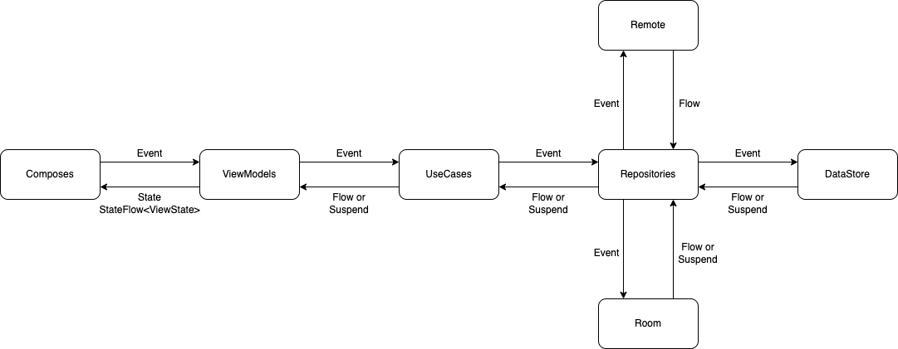

# Weather ☀️ Compose

This project demonstrates a weather application that shows the current weather for any location. The **Weapose** app is built using Android Jetpack Compose, MVVM, Clean Architecture, and other modern Android development tools.

## 🚧 In Progress

I'm working on implementing **Version Catalog** for the new Gradle versions, but **Dependabot** does not yet support this feature ([see this](https://github.com/dependabot/dependabot-core/pull/6249)). You can check the progress on the `v1.0.4/version_catalog` branch.

## 🔨 How to Build the App

- Use the latest version of Android Studio Canary.
- Add the `BASE_URL`, `API_KEY`, and `MAPS_API_KEY` inside `local.properties` to build and run the Weapose app. The configuration should look like this:

    ```properties
    BASE_URL=https://api.openweathermap.org/data/2.5/
    ONECALL_BASE_URL=https://api.openweathermap.org/data/3.0/
    API_KEY=your_open_weather_api_key_here
    MAPS_API_KEY=your_google_maps_api_key_here
    ```

## 📸 Screenshots

| Light Mode | Dark Mode |
| :---: | :---: |
|  |  |
|  |  |
|  |  |
|  |  |
|  |  |

## 📚 Features

- Display current weather by location or name.
- Display a seven-day weather forecast by location or name.
- Select a location using Google Maps.
- Search for locations by address name using Google Places.
- Support for dark mode.
- Support for dynamic material from Android 13 and above.
- Support for English and Vietnamese.
- Upcoming features...

## 🗂 Module

The Weapose app follows the Clean Architecture model combined with the MVVM design pattern. To learn more, refer to these resources:

- [Guide to app architecture by Google Android](https://developer.android.com/jetpack/guide)
- [Clean Architecture by Uncle Bob](https://blog.cleancoder.com/uncle-bob/2011/11/22/Clean-Architecture.html)

## 🔍 Unit Test

- Using [MockK](https://mockk.io/) to write unit tests.
- Using [Kotlin Reflection](https://kotlinlang.org/docs/reflection.html) to access private methods and properties.
- Using [Kotlin Kover](https://github.com/Kotlin/kotlinx-kover) to generate test coverage reports. To generate a report, run the command `./gradlew koverHtmlReport`.

## 🚊 Data Flow

The Weapose app uses `Flow` and `suspend` functions for data stream handling in the app.



## ❌ Error Flow

In the data module, when an error occurs, it is transformed into a `ResponseException`. In the domain and presentation layers, this error is further transformed into a `WeatherException` to display meaningful error messages in the UI.


## 📝 API Integration Details

The Weapose app integrates with the OpenWeather API to fetch current weather and forecasts. Here are the endpoints used:

- **Current Weather**: [OpenWeather Current Weather API](https://openweathermap.org/current)
- **5-Day Forecast**: [OpenWeather 5-Day Forecast API](https://openweathermap.org/forecast5)
- **One Call API**: The One Call API is used to get weather data for different time ranges, such as current, hourly, and daily forecasts. [OpenWeather One Call API](https://openweathermap.org/api/one-call-api)

### Handling Different Endpoints

To meet specific requirements and handle edge cases, we had to adapt and use different endpoints provided by OpenWeather. This ensures we can fetch accurate and comprehensive weather data for various needs.

## 🏗️ Architecture Overview

### Model-View-ViewModel (MVVM)

The MVVM architecture separates the code into three main components:

- **Model**: Handles the data and business logic. It interacts with the network or database to fetch and store data.
- **View**: Displays the data and forwards user interactions to the ViewModel.
- **ViewModel**: Serves as a bridge between the Model and the View. It holds the UI logic and the state of the UI.

### Data Flow

1. **User Interaction**: User actions are captured by the View.
2. **ViewModel**: The ViewModel processes these actions and updates the LiveData or StateFlow.
3. **Model**: The Model layer fetches or manipulates data and returns the results.
4. **ViewModel**: The ViewModel updates the LiveData or StateFlow with the new data.
5. **View**: Observes changes in LiveData or StateFlow and updates the UI accordingly.

### Exception Handling

- Errors in the data layer are captured and transformed into `ResponseException`.
- The ViewModel transforms these errors into `WeatherException`, which are then used to display user-friendly error messages in the UI.

## 🔍 Detailed Library Explanations

### Android Jetpack Compose

Jetpack Compose is used for building the UI. It simplifies and accelerates UI development on Android with less code, powerful tools, and intuitive Kotlin APIs.

### MockK

MockK is a mocking library for Kotlin. It is used for writing unit tests by providing features to create mocks and stubs.

### Kotlin Reflection

Kotlin Reflection is used to access private methods and properties, allowing for more comprehensive unit testing.

### Kotlin Kover

Kotlin Kover is a code coverage tool that integrates with Kotlin projects to generate detailed coverage reports.

## 📑 License


# Weather ️ Compose

This is an example for show current weather from any location. The **Weapose** is builted by Android Jetpack Compose, MVVM, Clean Architecture, etc.


## :construction: In progress

I'm trying to implement **Version Catalog** for new Gradle's version but the **Dependabot** doesn't support it ([seeing this](https://github.com/dependabot/dependabot-core/pull/6249)). 

You can check out from `v1.0.4/version_catalog` to see what I done.

## :hammer: How to build app

- Using the newest version of Android Studio Canary.
- You must add `BASE_URL`, `API_KEY` and `MAPS_API_KEY` inside `local.properties` to build and run Weapose app, like the code below:

    ```kotlin
    BASE_URL=https://api.openweathermap.org/data/2.5/
    API_KEY=API_KEY // Fill your open weather api key in here
    MAPS_API_KEY=GOOGLE_MAPS_API_KEY // Fill your google maps api key in here
    ```

## :camera: Screenshots

| Light mode | Dark mode |
| :---: | :---: |
|  |  |
|  |  |
|  |  |
|  |  |
|  |  |

## :blue_book: Features

- Show the current weather by location or name.
- Show the seven days weather by location or name.
- Choice the location you want by using Google Map.
- Search location by address name by using Google Places.
- Support dark mode.
- Support dynamic material from Android 13 and above.
- Support English and Vietnamese.
- Upcomming ….

## :open_file_folder: Module

Weapose is built according to the Clean Architecture model combined with the MVVM design pattern. To learn more, refer to the links below.

- Guild to app architecture by Google Android.
- Clean architectur by Uncle Bob.

## :mag_right: Unit test

- Using [MockK](https://mockk.io/) to write unit test.
- Using [Kotlin Reflection](https://kotlinlang.org/docs/reflection.html) to access the private method, private property, etc.
- Using [Kotlin Kover](https://github.com/Kotlin/kotlinx-kover) to generate the test coverage. To generate, you just run command ` ./gradlew koverHtmlReport`.

## :tram: Data flow

Weapose is supported by `Flow` and `suspend` for data stream flow in app.


## :x: Error flow

In data module, when data is returned error, I will transform the error to `ResponseException`. And then in domain and presentation, I transform the error from `ResponseException` to `WeatherException` to show the error to UI.


## :bell: Notes

If you have any issues with the project, don't hesitate to create an issue. Also I'm glad you can contribute to my project.

Let's develop together to create quality and beautiful Android Jetpack Compose applications!

## :coffee: Buy me a coffee

Welcome to my github! :wave:

Don't forget to buy me a coffee so that I have more motivation to improve the project! :fire:

[](https://www.buymeacoffee.com/hide.your.code)

## License

```
Copyright 2022 The Android Open Source Project

Licensed under the Apache License, Version 2.0 (the "License");
you may not use this file except in compliance with the License.
You may obtain a copy of the License at

    http://www.apache.org/licenses/LICENSE-2.0

Unless required by applicable law or agreed to in writing, software
distributed under the License is distributed on an "AS IS" BASIS,
WITHOUT WARRANTIES OR CONDITIONS OF ANY KIND, either express or implied.
See the License for the specific language governing permissions and
limitations under the License.
```
